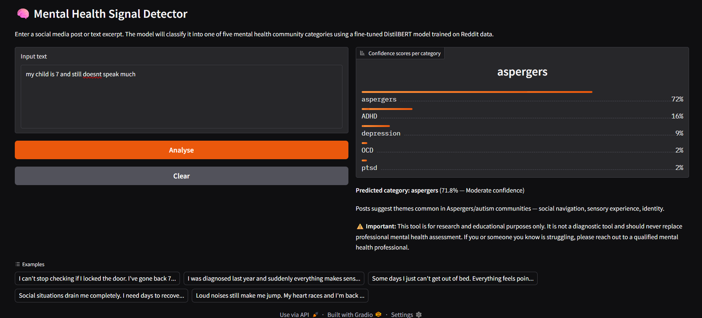
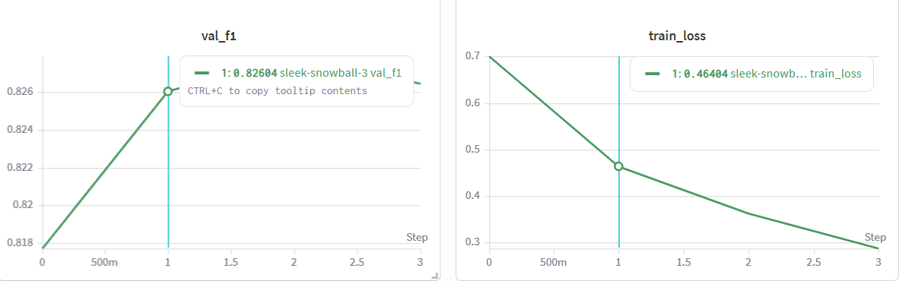

# Mental Health Signal Detector

Fine-tuned DistilBERT model for classifying social media text into five mental
health community categories. Trained on 108,000 Reddit posts across r/ADHD,
r/OCD, r/depression, r/ptsd, and r/aspergers.

> ⚠️ Research and educational use only. Not a diagnostic tool.

## Results

| Class | Precision | Recall | F1 |
|-------|-----------|--------|----|
| OCD | 0.93 | 0.87 | 0.90 |
| ADHD | 0.87 | 0.85 | 0.86 |
| PTSD | 0.85 | 0.80 | 0.82 |
| Aspergers | 0.74 | 0.81 | 0.77 |
| Depression | 0.71 | 0.81 | 0.76 |
| **Weighted avg** | **0.84** | **0.83** | **0.836** |

**Test accuracy: 83.4%**

## Demo



## Training Curves



## Architecture

- Base model: `distilbert-base-uncased` (66M parameters)
- Task: Multi-class sequence classification (5 classes)
- Max token length: 128
- Training: 4 epochs, lr=2e-5, batch size=32, linear warmup
- Class imbalance handled via inverse-frequency class weights
- Experiment tracking: Weights & Biases

## Project Structure
```
├── data/processed/       # train/val/test splits
├── src/
│   ├── preprocess.py     # text cleaning pipeline
│   ├── dataset.py        # PyTorch Dataset + tokenisation
│   ├── model.py          # DistilBERT classification head
│   ├── train.py          # training loop with W&B logging
│   └── evaluate.py       # metrics, confusion matrix, error analysis
├── app/
│   └── gradio_app.py     # interactive demo UI
├── outputs/
│   └── confusion_matrix.png
└── ethics/
    └── ETHICS.md
```

## Setup
```bash
git clone https://github.com/YOUR_USERNAME/mental-health-signal-detector
cd mental-health-signal-detector
python -m venv venv && venv\Scripts\activate
pip install -r requirements.txt
python app/gradio_app.py
```

## Ethical Considerations

See [ethics/ETHICS.md](ethics/ETHICS.md) for full discussion of dataset use,
limitations, and responsible AI considerations.